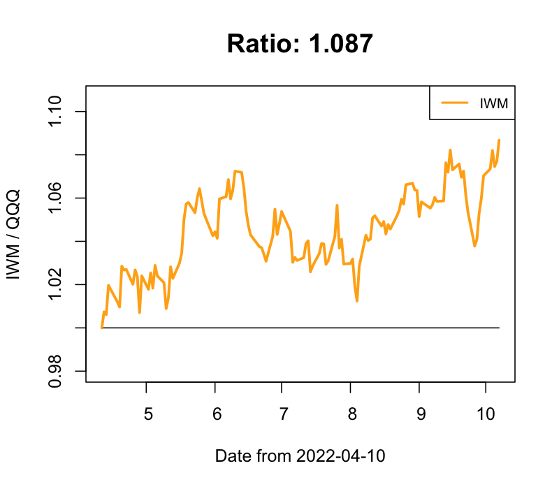
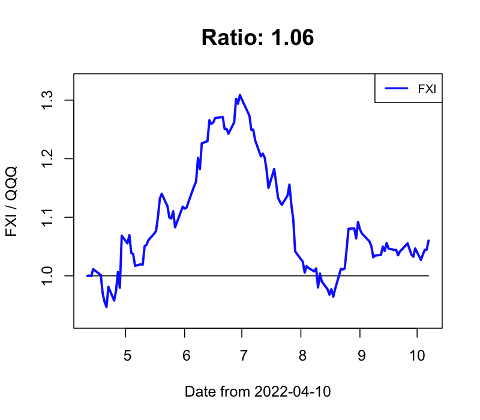
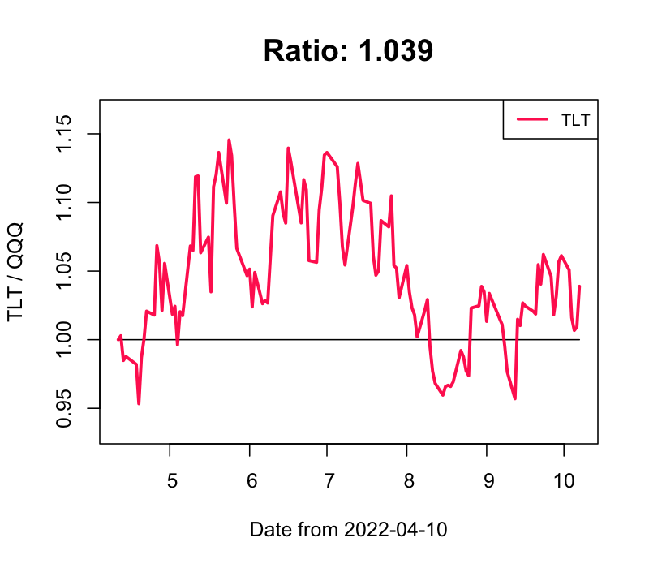

## Stock Market Prediction (Buy & Sell)

### 逆張り投資 買いタイミング判定 ver 0.99.1

- 2021-06-03 index銘柄

  - 買いタイミング！: EDOC, VHT, XLV

  - 利確タイミング！: FEZ, GDXJ, VDE, VEA, XLF

  - 強く利確タイミング！！！: GLD, GLDM, IAU, IYR, VGK, VWO, XLRE

- 2021-06-03 レバレッジ銘柄

  - 買いタイミング！: LABU

  - 強く買いタイミング！！！: CURE

  - 利確タイミング！: ERX, EDC

  - 強く利確タイミング！！！: INDL, DRN

- 2021-06-03 個別銘柄

  - 買いタイミング！: ZI

  - 強く買いタイミング！！！: NVST, AMGN, BLDR

  - 強く利確タイミング！！！: RBLX, AI

### QQQ との変化比率

　**0.9以下 / 1.1以上の場合には、物色 / 手仕舞いも視野に**

- IWM / QQQ

- VTI / QQQ

- SPY / QQQ

- DIA / QQQ

- VOO / QQQ

- AGG / QQQ

- KWEB / QQQ

- CLOU / QQQ

- FEZ / QQQ

- FINX / QQQ

- FXI / QQQ

- GLD / QQQ

- VIG / QQQ

- VTV / QQQ

- SMH / QQQ

- TLT / QQQ

