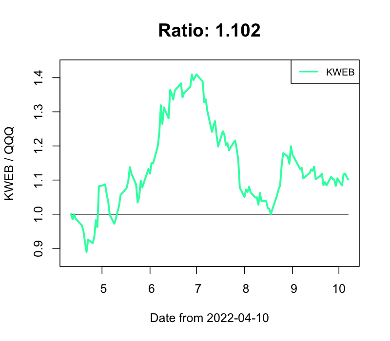
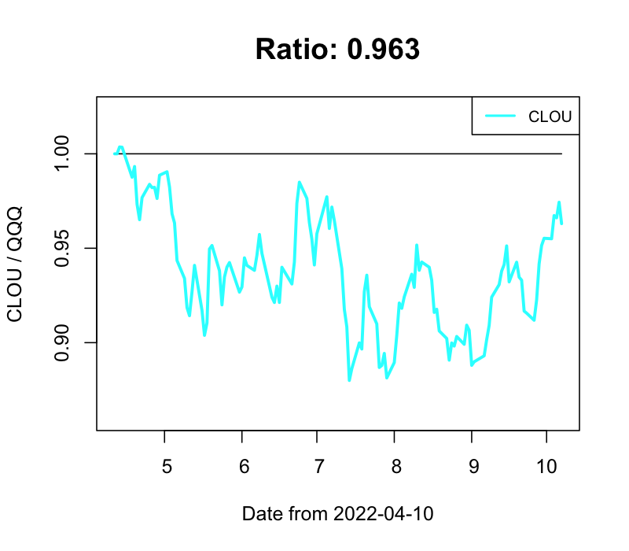
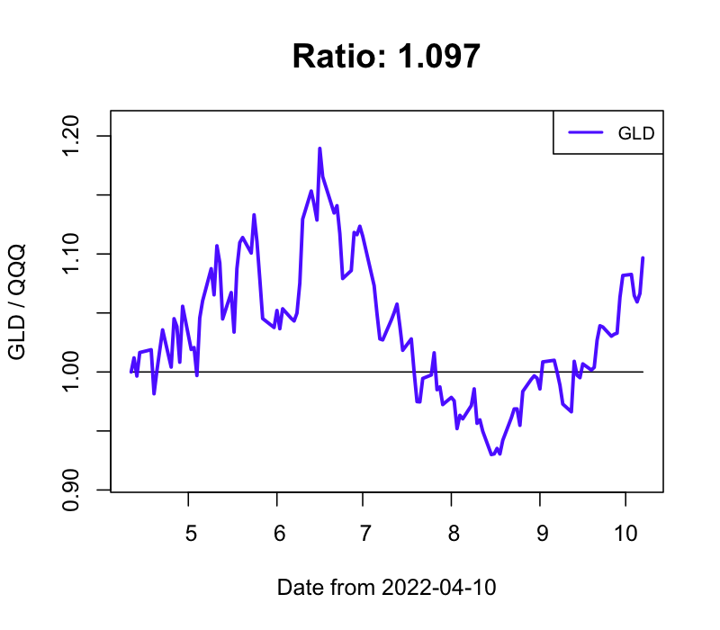

## stock-market-prediction

### 逆張り投資 買いタイミング判定

- 2021-05-13 index銘柄

  - 買いタイミング！: VTI, SPY, DIA, VOO, AGG, AGGY, BND, BUG, HYG, ICLN, IYR, JNK, LQD, SHE, SPLG, SPTM, SRET, SUSA, TLT, VEA, VONE, VOX, VPU, VT, XLC, XLU

  - 強く買いタイミング！！！: QQQ, IWM, AIQ, BOTZ, CLOU, EBIZ, EDOC, FINX, FXI, MGK, MILN, PBD, SMH, SPYG, VBK, VCR, VGT, VIOG, VONG, VOOG, VOT, VPL, VUG, VWO, VXF, XLK, XLY

  - 利確タイミング！: GDX, GLD, GLDM, VDE

  - 強く利確タイミング！！！: DBA

- 2021-05-13 レバレッジ銘柄

  - 買いタイミング！: UDOW, CHAU, DRN

  - 強く買いタイミング！！！: SOXL, YINN, WEBL, TECL, TQQQ, CWEB, LABU, TNA, SPXL, EDC, QLD

  - 利確する銘柄なしで、見送り

- 2021-05-13 個別銘柄

  - 買いタイミング！: SNAP, RPRX, SE

  - 強く買いタイミング！！！: PLTR, SQ, GDRX, AFRM, PINS, CRWD, U, ZM, NIO, TWTR, ABNB, DOCU, AI, ZI

  - 利確する銘柄なしで、見送り

### QQQ との変化比率

　**経験的に、0.9以下、1.1以上の場合には、手仕舞いを検討すること**

- IWM / QQQ

- VTI / QQQ

- SPY / QQQ

- DIA / QQQ

- VOO / QQQ

- AGG / QQQ

- KWEB / QQQ

- CLOU / QQQ

- FEZ / QQQ

- FINX / QQQ

- FXI / QQQ

- GLD / QQQ

- VIG / QQQ

- VTV / QQQ

- SMH / QQQ

- TLT / QQQ

