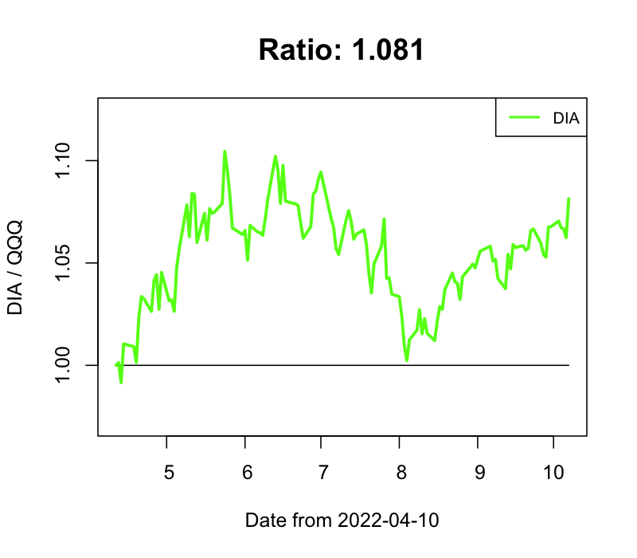
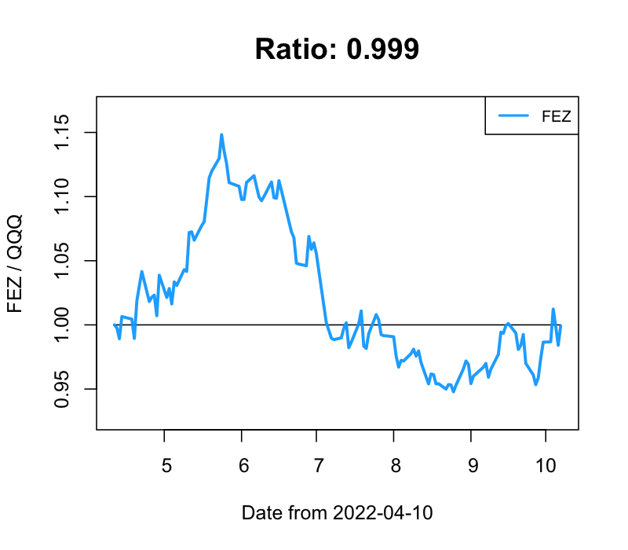
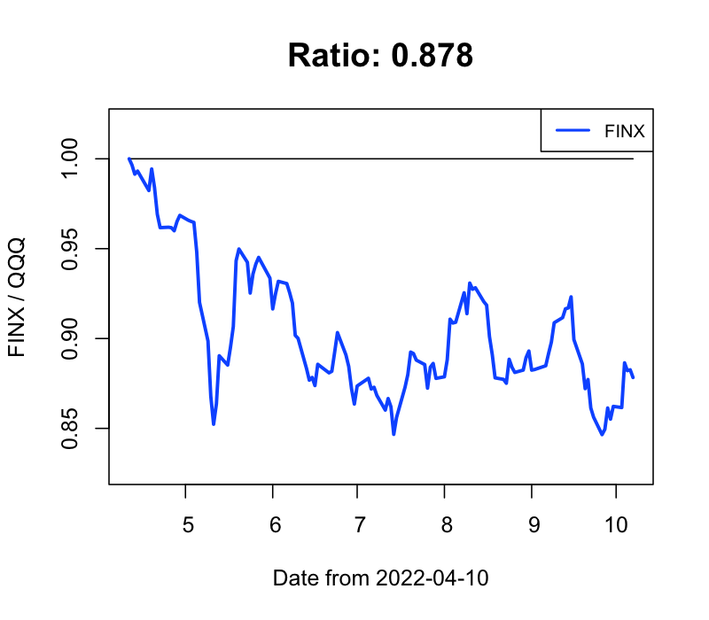

## Stock Market Prediction (Buy & Sell)

### 逆張り投資 買いタイミング判定 ver 0.99.1

"- 2022-10-10 index銘柄"

"  - 買いタイミング！: IWM, AIQ, BOTZ, BUG, CLOU, EBIZ, EDOC, FEZ, FINX, FXI, HDV, HYG, JNK, LQD, MGK, MILN, SHE, SMH, TIP, VAW, VBK, VCR, VEA, VFH, VGK, VHT, VIOG, VIS, VONG, VOT, VOX, VPL, VUG, VWO, VXF, VYM, XLC, XLF, XLI, XLV, XLY"

"  - 強く買いタイミング！！！: QQQ, VTI, SPY, DIA, VOO, AGG, AGGY, BND, ICLN, IYR, PBD, SPLG, SPTM, SPYD, SPYG, SRET, SUSA, TLT, VDC, VGT, VIG, VONE, VONV, VOOG, VOOV, VPU, VT, VWOB, XLK, XLP, XLRE, XLU"

"  - 利確する銘柄なしで、見送り"

"- 2022-10-10 レバレッジ銘柄"

"  - 強く買いタイミング！！！: SOXL, YINN, WEBL, TECL, TQQQ, UDOW, CHAU, CWEB, CURE, LABU, TNA, INDL, SPXL, FAS, DRN, EDC, QLD"

"  - 利確する銘柄なしで、見送り"

### QQQ との変化比率

　**0.9以下 / 1.1以上の場合には、物色 / 手仕舞いも視野に**

- IWM / QQQ

- VTI / QQQ

- SPY / QQQ

- DIA / QQQ

- VOO / QQQ

- AGG / QQQ

- KWEB / QQQ

- CLOU / QQQ

- FEZ / QQQ

- FINX / QQQ

- FXI / QQQ

- GLD / QQQ

- VIG / QQQ

- VTV / QQQ

- SMH / QQQ

- TLT / QQQ

