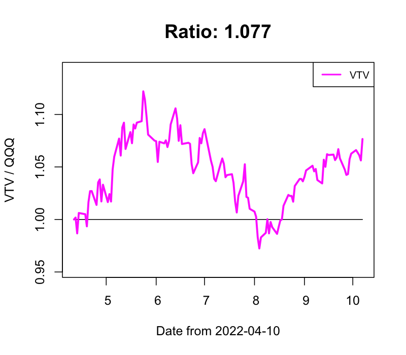

## Stock Market Prediction (Buy & Sell)

### 逆張り投資 買いタイミング判定 ver 0.99.1

- 2021-07-04 index銘柄

  - 買いタイミング！: FEZ, FXI, GDX, GDXJ, GLD, GLDM, IAU, SPYD, SRET, VAW, VEA, VGK

  - 利確タイミング！: AGG, AGGY, AIQ, LQD

  - 強く利確タイミング！！！: QQQ, VTI, SPY, VOO, CLOU, HYG, JNK, MGK, MILN, SHE, SPLG, SPTM, SPYG, SUSA, VCR, VGT, VHT, VONE, VONG, VOOG, VOT, VOX, VUG, XLC, XLK, XLV, XLY

- 2021-07-04 レバレッジ銘柄

  - 買いタイミング！: YINN, CHAU

  - 強く買いタイミング！！！: CWEB

  - 利確タイミング！: WEBL, CURE, SPXL

  - 強く利確タイミング！！！: TECL, TQQQ, QLD

  - 早めに利確タイミング！！！！: CURE, SPXL

- 2021-07-04 個別銘柄

  - 強く買いタイミング！！！: GDRX

  - 利確する銘柄なしで、見送り

  - 早めに利確タイミング！！！！: PINS

### QQQ との変化比率

　**0.9以下 / 1.1以上の場合には、物色 / 手仕舞いも視野に**

- IWM / QQQ

- VTI / QQQ

- SPY / QQQ

- DIA / QQQ

- VOO / QQQ

- AGG / QQQ

- KWEB / QQQ

- CLOU / QQQ

- FEZ / QQQ

- FINX / QQQ

- FXI / QQQ

- GLD / QQQ

- VIG / QQQ

- VTV / QQQ

- SMH / QQQ

- TLT / QQQ

