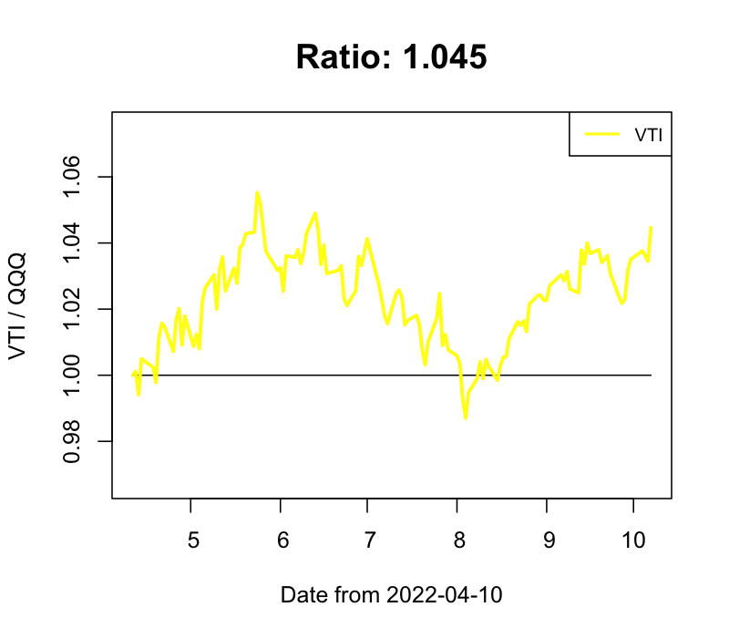
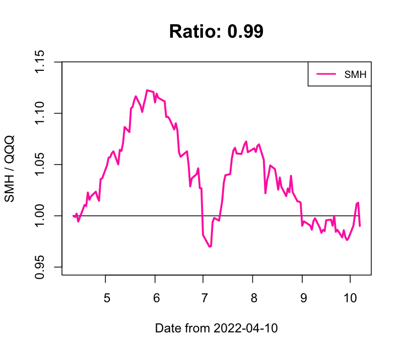

## stock-market-prediction

### 逆張り投資 買いタイミング判定

- 2021-05-13 index

index買いタイミング！: IWM, VTI, SPY, VOO, AGG, AGGY, BND, BUG, FXI, HYG, ICLN, JNK, LQD, SHE, SPLG, SPTM, SPYG, SRET, SUSA, TLT, VONE, VOOG, VOX, VPU, VT, VWO, XLC, XLU

index強く買いタイミング！！！: QQQ, AIQ, BOTZ, CLOU, EBIZ, EDOC, FINX, MGK, MILN, PBD, SMH, VBK, VCR, VGT, VIOG, VONG, VOT, VPL, VUG, VXF, XLK, XLY

index利確タイミング！: GDX, GLDM, VAW, VDE

index強く利確タイミング！！！: DBA

- 2021-05-13 レバレッジ

レバレッジ銘柄、強く買いタイミング！！！: SOXL, YINN, WEBL, TECL, TQQQ, CWEB, LABU, TNA, SPXL, EDC, QLD

利確するレバレッジ銘柄なしで、見送り

- 2021-05-13 Individual

個別銘柄、買いタイミング！: SNAP, RPRX, CRWD, SE

個別銘柄、強く買いタイミング！！！: PLTR, SQ, GDRX, AFRM, PINS, U, ZM, NIO, TWTR, ABNB, DOCU, AI, ZI

利確するIndividual銘柄なしで、見送り

### QQQ との変化比率

- IWM / QQQ

- VTI / QQQ

- SPY / QQQ

- DIA / QQQ

- VOO / QQQ

- AGG / QQQ

- KWEB / QQQ

- CLOU / QQQ

- FEZ / QQQ

- FINX / QQQ

- FXI / QQQ

- GLD / QQQ

- VIG / QQQ

- VTV / QQQ

- SMH / QQQ

- TLT / QQQ

